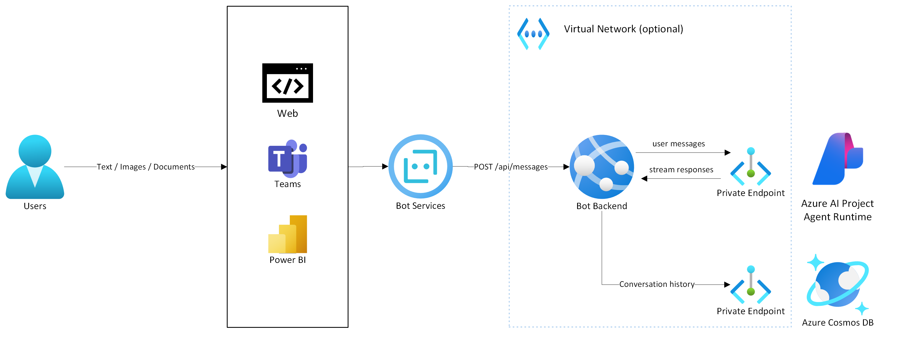

# Azure Agents Travel Assistant

End-to-end sample of a travel agent implemented with Azure AI Agent Service and Bot Framework. The travel assistant leverages the Azure AI platform to understand images and documents, providing assistance during travel planning and common travel situations. Key features include:

- **Image Recognition**: Identify landmarks, extract text from travel documents, and more.
- **Document Understanding**: Parse itineraries, booking confirmations, and other travel-related documents.
- **Travel Assistance**: Offer recommendations, reminders, and support for various travel scenarios.

> [!IMPORTANT]
> The Azure AI Agent Service is currently in Private Preview. This early stage of development means the product is actively evolving, with significant updates and improvements expected. Users should anticipate changes as we work towards refining features, enhancing functionality, and expanding capabilities. We welcome feedback and contributions during this phase to help shape the future of the product. [Azure AI Agent Service: Private Preview Waitlist Application](https://customervoice.microsoft.com/Pages/ResponsePage.aspx?id=v4j5cvGGr0GRqy180BHbR4zfDSs3yfVOpxzjhs7PkSlUNlhGSlZTMkFBSDNaSVRMSDZBUjhPT1VLMCQlQCN0PWcu)

## Solution Architecture

Below are the main components deployed as part of this solution:



- User sends messages through one of the [supported Bot Framework Channels](https://learn.microsoft.com/en-us/azure/bot-service/bot-service-channels-reference?view=azure-bot-service-4.0);
- The Azure Bot Service connects to the Python web application through the /api/messages endpoint;
- The Application communicates with the Azure AI Agent Runtime to process incoming messages using assistants;
- Results are streamed back in realtime, and posted back to the user's channel;
- The conversation history is stored in Cosmos DB, as well as ephemeral conversation state.
> Note: Communications between App Services, Azure AI and Cosmos DB can be configured to use Private Endpoints. Authentication to these services is done using a User-Assigned Managed Identity.

## Getting Started

To get started with the Azure Agents Travel Assistant, follow the instructions below to set up your environment and run the sample application.

### Prerequisites

- An Azure subscription
    - Azure OpenAI: 50k Tokens per Minute of Pay-as-you-go quota for GPT-4o or GPT-4o-mini
    - Azure App Services: Available VM quota - P0v3 recommended
- Azure CLI
- Azure Developer CLI
- Python 3.10 or later (for running locally)

### Installation

1. Before you begin, make sure you are logged in to both AZ and AZD CLIs
    ```sh
    az login # or az login -t <TENANT_ID>
    azd auth login # or azd auth login --tenant <TENANT_ID>
    ```

2. Clone the repository:
    ```sh
    git clone https://github.com/Azure-Samples/azureai-travel-agent-python
    cd azureai-travel-agent-python
    ```

3. Deploy the infrastructure and sample app
    ```sh
    azd up
    ```
You will be prompted to select and Azure subscription, a region, and an environment name. The environment name should be a short string, and it will be used to name the deployed resources.

4. (Optional) Run locally:
    ```sh
    cd src
    pip install -r requirements.txt
    python app.py
    ```

5. (Optional) Open http://localhost:3978/api/messages in the [Bot Framework Emulator](https://github.com/microsoft/BotFramework-Emulator)

## Features

- **Publicly available travel knowledge**: Ask about well-known destinations and tourist attractions
- **Document Upload**: Upload PDF, Word and other document formats and add to File Search to use the information contained as part of the conversation
- **Image Upload**: Upload images and ask questions about the location, landmark or directions
- **Web search**: The Agent may use Bing Search to obtain updated information about certain locations, accomodations, weather and more.

## Guidance

### Regional Availablility

You may deploy this solution on any regions that support Azure AI Agents. Some components, such as Bot Service and Bing Search, are deployed in a global model, and as such are not tied to a single region. Make sure to review Data Residency requirements.

**At this time, only the East US region supports Azure AI Agents.**

- [Regionalization in Azure AI Bot Service](https://learn.microsoft.com/en-us/azure/bot-service/bot-builder-concept-regionalization?view=azure-bot-service-4.0)

If you need to deploy services across more than one region, use the commands below to set regions for specific services. Services with unspecified locations will be created in the "main" region chosen.

```sh
# azd env set AZURE_<SERVICENAME>_LOCATION <LOCATION>
# For example:
azd env set AZURE_APPSERVICE_LOCATION eastus2
azd env set AZURE_COSMOSDB_LOCATION westus
```

Review ./infra/main.parameters.json for a full list of available environment configurations.

### Model Support

This quickstart supports both GPT-4o and GPT-4o-mini. Ohter models may also perform well depending on question complexity. Standard deployments are used by default, but you may update them to Global Standard or Provisioned SKUs after successfully deploying the solution.

### Troubleshooting

- Provisioning errors:
    - `Azure Open AI: InsufficientQuota`: Your Azure Subscription does not have enough pay-as-you-go quota for the selected region/model. Select a different subscription, region, model, or [request quota](https://learn.microsoft.com/en-us/azure/ai-services/openai/how-to/quota?tabs=rest).
    - `Bing Search: Insufficient Quota`: You cannot add a new Bing resource in the selected Subscription and SKU. Select a different SKU or region, or delete other Bing Search resources
    - `Cosmos DB: Service Unavailable`: This region may be under high demand and does not have available resources for your subcription type. Select a different region or try again later
    - `Any resource: Invalid Resource Location, the resource already exists`: A resource with the same name already exists in a different region or resource group. Delete existing resources or retry with a different environment name
- Runtime errors:
    - `Message: Invalid subscription ID`: Your subscription may not be enabled for Azure AI Agents. During the preview of this functionality, it may be required to complete additional steps to onboard your subscription to Azure AI Agents. Alternatively, update the .env file (locally) or app service environment variables (on Azure) to point the application to another AI Project.
    - `azure.core.exceptions.ClientAuthenticationError: (PermissionDenied) Principal does not have access to API/Operation.`: Your current user does not have Azure ML Data Scientist role, or your IP is not allowed to access the Azure AI Hub. Review the RBAC and networking configurations of your AI Hub/Project. Similar exceptions may happen when not logged in with the Azure CLI.

## Security

Most of the resources deployed in this template leverage Private Endpoints and Entra ID authentication for enhanced security. Make sure to use the corresponding parameters to use these features.

There is currently one exception to this pattern in this repository:

- Bot Service does not support Entra ID authentication for the Direct Line / Web channel.

For this reason, this service will use a secret, properly stored in the Key Vault deployed with the quickstart.

## Resources

- [Getting started with Azure OpenAI Assistants (Preview)](https://learn.microsoft.com/en-us/azure/ai-services/openai/how-to/assistant)
- [Azure OpenAI Service](https://learn.microsoft.com/azure/ai-services/openai/overview)
- [Generative AI For Beginners](https://github.com/microsoft/generative-ai-for-beginners)

## How to Contribute

This project welcomes contributions and suggestions. Most contributions require you to agree to a Contributor License Agreement (CLA) declaring that you have the right to, and actually do, grant us the rights to use your contribution. For details, visit <https://cla.opensource.microsoft.com>

When you submit a pull request, a CLA bot will automatically determine whether you need to provide a CLA and decorate the PR appropriately (e.g., status check, comment). Simply follow the instructions provided by the bot. You will only need to do this once across all repos using our CLA.

This project has adopted the [Microsoft Open Source Code of Conduct](https://opensource.microsoft.com/codeofconduct/). For more information see the [Code of Conduct FAQ](https://opensource.microsoft.com/codeofconduct/faq) or contact <opencode@microsoft.com> with any additional questions or comments.

## Key Contacts & Contributors

| Contact | GitHub ID | Email |
|---------|-----------|-------|
| Marco Cardoso | @MarcoABCardoso | macardoso@microsoft.com |

## License

This project may contain trademarks or logos for projects, products, or services. Authorized use of Microsoft trademarks or logos is subject to and must follow [Microsoft's Trademark & Brand Guidelines](https://www.microsoft.com/en-us/legal/intellectualproperty/trademarks/usage/general). Use of Microsoft trademarks or logos in modified versions of this project must not cause confusion or imply Microsoft sponsorship. Any use of third-party trademarks or logos are subject to those third-party's policies.
